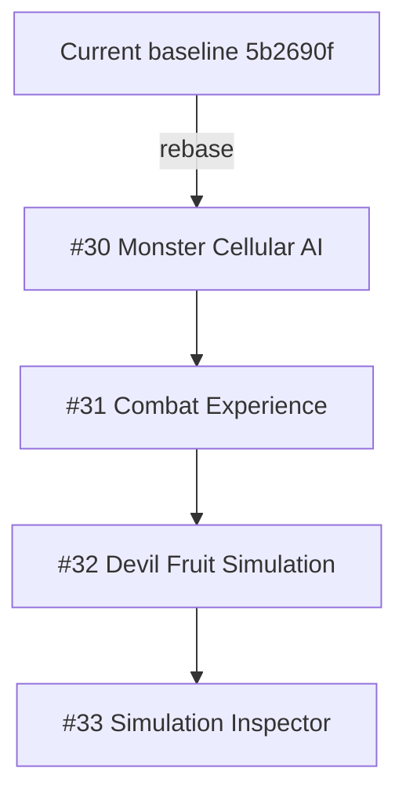
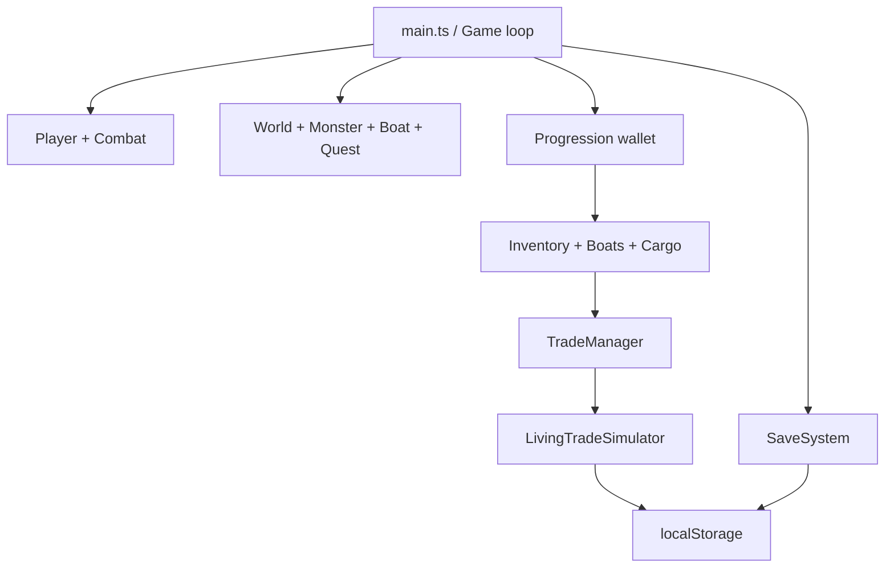

# Pirate Fruit — Phase S0 Server Migration Audit

วันที่ตรวจ: 2026-07-15 (Asia/Bangkok)  
ปรับปรุงผล baseline gate: 2026-07-16  
ขอบเขต: Phase S0 เท่านั้น — ไม่มีการเปลี่ยน Gameplay, UI, Three.js rendering หรือเริ่มสร้าง Server; มีเฉพาะ test-harness stabilization

## 1. Executive status

สถานะ Phase S0: **PASS — พร้อม merge และสร้าง baseline tag**

- Remote default branch ที่ตรวจ: `claude/blox-fruits-three-js-roadmap-1f2f5u`
- Code baseline commit: `5b2690f31a92c0eee3c9a3f965bdee6912be1f73`
- Render Blueprint ปัจจุบัน deploy Static Site จาก `client/`, build ด้วย `npm install && npm run build`, publish `dist/`
- TypeScript check: PASS
- Production build: PASS
- Unit/integration suite: PASS — 39 files / 435 tests, exit 0
- Extended economy 20,000 ticks: PASS — 1 file / 1 test, exit 0, ไม่มี worker heartbeat error
- ผู้ใช้ยืนยันเมื่อ 2026-07-16 ว่า Render deploy branch คือ `claude/blox-fruits-three-js-roadmap-1f2f5u`

Baseline commit ข้างต้นเป็น rollback anchor แบบ immutable และ S0 พร้อมติด release tag `singleplayer-v1.0` หลัง merge PR นี้

## 2. Repository และ deployment baseline

| รายการ | ผลตรวจ | สถานะ/ข้อสรุป |
|---|---|---|
| Repository | `nustanakritwithai/Pirate-fruit-` | ใช้งานได้และมีสิทธิ์ push |
| Default branch | `claude/blox-fruits-three-js-roadmap-1f2f5u` | ใช้เป็น source of truth ของ S0 |
| Baseline commit | `5b2690f31a92c0eee3c9a3f965bdee6912be1f73` | rollback anchor |
| Render config | `render.yaml` | Static Site, `rootDir: client`, publish `dist` |
| Render deploy branch | `claude/blox-fruits-three-js-roadmap-1f2f5u` | ผู้ใช้ยืนยันจาก Render เมื่อ 2026-07-16; Blueprint เองไม่ได้เก็บค่านี้ |
| Current structure | root + `client/` | ยังไม่มี root workspace, `server/` หรือ `shared/` |
| Local checkout metadata | HEAD `12177e2...`, ahead 2 / behind 16 และมี working tree ต่างจาก Git index 71 files | ห้ามใช้ `git add -A`; งาน S1 ต้องเริ่มจาก clean clone/worktree ของ remote baseline |

ข้อสังเกต: Blueprint ระบุ build/deploy shape แต่ branch selection เป็นค่าใน Render Dashboard จึงต้องอาศัยการยืนยันจาก Dashboard ซึ่งได้รับแล้ว

## 3. Open PR audit

มี Open PR 10 รายการ ณ วันที่ตรวจ

| PR | สถานะปัจจุบัน | Dependency/ความเสี่ยง | คำแนะนำ |
|---|---|---|---|
| #30 Living Monster Cellular AI | Draft, mergeable=false, base เก่า | แตะ `main.ts`, `Monster.ts`, `MonsterManager.ts`; เป็นต้นทางของ stack | **Rebase ก่อน** บน baseline แล้วแก้ conflict/test แยก; merge เป็นลำดับแรกหากยังต้องการ |
| #31 Combat Experience | Draft, mergeable=false, base เก่า | รวม dependency #30 และแตะ monster/combat | **Rebase หลัง #30** และ retarget ไป commit หลัง #30 |
| #32 Devil Fruit Simulation | Draft, mergeable=false, base เก่า | รวม #30→#31; แตะ `PlayerCombat` และ Living Economy | **Rebase หลัง #31**; ห้ามรวมตรงกับ S0/S1 |
| #33 Simulation Inspector | Draft, mergeable=false, base เก่า | รวม #30→#32 ทั้ง stack; แตะ economy/NPC/vite | **Rebase หลัง #32**; ตรวจว่า dev-only และถูก tree-shake ใน production |
| #23 Restore Render `dist` | Draft, mergeable=true | `render.yaml` ปัจจุบันใช้ `dist` อยู่แล้ว | **Close: superseded/already applied** |
| #22 Render `client/dist` | Draft, mergeable=true | ผิดกับ `rootDir: client`; publish ควรเป็น `dist` | **Close: obsolete/incorrect** |
| #9 Blox Fruits proposal | Open, mergeable=true, เก่ามาก | เอกสารถูกแทนด้วย implementation/roadmap ปัจจุบัน | **Close/archive as superseded** |
| #8 Energy & Mastery databooks | Draft, mergeable=true, เก่ามาก | สร้าง domain model ซ้ำกับ `progression`, `stats`, `combat`, `ItemInventory` | **Close as superseded**; cherry-pick เฉพาะข้อมูลที่พิสูจน์แล้วภายหลัง S1 |
| #7 Health databook | Draft, mergeable=true, เก่ามาก | model ซ้ำกับ controller/stats/progression | **Close as superseded** |
| #6 Experience databook | Draft, mergeable=true, เก่ามาก | model ซ้ำกับ levels/progression | **Close as superseded** |

S0 นี้ยังไม่ merge/close/rebase PR ใด เพื่อไม่เปลี่ยน repository state เกินขอบเขต audit

### PR dependency map



ห้าม merge #33 เพื่อเอาทั้ง stack เข้ามาครั้งเดียว เพราะจะทำให้ dependency และ regression ของแต่ละระบบแยกตรวจไม่ได้

## 4. Current architecture และ dependency map

`client/src/main.ts` เป็น composition root และสร้าง manager เกือบทุกระบบโดยตรง



Coupling ที่ต้องแก้ตามลำดับ:

1. Gameplay/UI เรียก manager ที่ persist เองโดยตรง
2. `TradeManager` เป็นทั้ง transaction service, cargo repository และ adapter ของ Living Economy
3. `LivingTradeSimulator` เป็นทั้ง domain simulation, global world state, player economy state และ persistence trigger
4. `ProgressionManager` เป็น wallet หลัก แต่ Inventory/Boat save ยังเก็บสำเนา coins เพื่อรองรับ legacy
5. Quest/Monster reward เขียน progression ฝั่ง Client โดยตรง

## 5. localStorage inventory และ Save schema lock

รายการ key ที่พบทั้งหมดใน production source มี 8 keys (ไม่พบ `sessionStorage`)

| Key | Schema/version | State ปัจจุบัน | Owner ในอนาคต |
|---|---|---|---|
| `pirate-fruit:save-v1` | payload `saveVersion: 4`, รองรับ 2–4 | position x/y/z, heading, cameraYaw, worldTime, spawnId, islandId, HP/Energy/MP | checkpoint/resources ไป Server; cameraYaw คง Client |
| `pirate-fruit:progression-v1` | envelope version 1 | level, EXP, stat points, combat/vitality/blade/ranged/fruitPower/mana, mastery, coins, completed/active quest | Server authoritative |
| `pirate-fruit:boats-v1` | ไม่มี envelope version | coins legacy copy, owned boat IDs, selected boat, hull/cannon/sail upgrades | Server authoritative |
| `pirate-fruit:items-v1` | ไม่มี envelope version | coins legacy copy, owned sword/gun/style/fruit, consumables, quickslots, equipped loadout/mastery fields | ownership/loadout Server; quickslot presentation อาจ Client |
| `pirate-fruit:loadout-v1` | ไม่มี version | legacy 5-slot loadout + active category | legacy/อาจไม่อยู่ใน current composition; migrate แบบ defensive แล้ว retire |
| `pirate-fruit:cargo-v1` | ไม่มี version | maxSlots, maxWeight, commodity slots/quantity | Server authoritative |
| `pirate-fruit:economy-v1` | envelope version 8; `economyBalanceVersion: 3` | cells, stock, prices, production, factories, orders, traders, ships, reservations, memory, reputation, contracts/player economy, genome, logs/news | Global Server authoritative; ต้องแยก player economy ออกจาก world snapshot |
| `pirate-fruit:graphics-v1` | tier string, ไม่มี version | graphics quality preference | Client-only |

### Save migration constraints

- Coins ซ้ำอยู่ใน progression, boats และ items; ให้ `progression-v1.progression.coins` เป็น source of truth หลัง migration แรก
- Key ที่ไม่มี envelope version ต้องเพิ่ม sanitizer + explicit source schema version ก่อน remote migration
- `pirate-fruit:economy-v1` ผสม global state กับ `playerEconomy`; ต้องแยกก่อน S7 ไม่เช่นนั้นผู้เล่นคนเดียวจะกลายเป็นส่วนหนึ่งของ world snapshot ร่วม
- Migration request ต้องมี server-issued identity และ idempotency key; mark migrated ใน database transaction เดียว
- เก็บ local backup แบบอ่านอย่างเดียวชั่วคราว แต่ห้ามนำเข้าอัตโนมัติซ้ำ

## 6. Client simulation/tick inventory

| Loop | ตำแหน่ง | ความถี่/กลไก | แผนย้าย |
|---|---|---|---|
| Main game logic | `engine/Game.ts` | fixed timestep 60 Hz, max 5 substeps, render ผ่าน `setAnimationLoop` | อยู่ Client จนถึง authority phase ของแต่ละระบบ |
| Living Economy | `main.ts` → `tradeManager.living.tick()` | ทุก 5,000 ms ใน Browser | ย้าย S7; Online mode ต้องหยุด browser tick |
| Economy manual ticks | `EconomyDebugPanel` | 1/5/10/50 ticks จาก UI debug | dev-only endpoint/tool ภายหลัง; ปิดใน online production |
| Economy persistence | `LivingTradeSimulator.tick()` และ player buy/sell | synchronous save ทุก tick/transaction | Repository ใน S3; server snapshot 30–60s + transaction สำคัญ |
| Monster AI | `MonsterManager.update(dt)` | 60 Hz Client | อยู่ Client จน S11 |
| Player/Combat/Boat/Naval/NPC | Game updatables | 60 Hz Client | อยู่ Client จน S10–S14 ตาม roadmap |
| Autosave checkpoint | `SaveSystem.update(dt)` | ทุก 3 วินาที + `beforeunload` | debounce repository ใน S3/S6 |

ลำดับภายใน Living Economy tick ปัจจุบัน: production/consumption → adaptive factories → recipes/demand/prices/spoilage → inter-island demand → world modifiers → player economy → dynamic trade orders → cargo movement → import convoys → economy genome → bounded logs/news → save

## 7. State ownership inventory

### ย้ายไป Server แบบ authoritative ตาม phase

- Session/player identity
- Coins, level, EXP, stats, mastery
- Item ownership, equipment validation, consumables
- Boat ownership/upgrades และ cargo capacity
- Cargo quantities
- Quest progress/rewards/checkpoints และ HP/Energy/MP persistence
- Economy world: tick, stock, production, factories, orders, traders, routes, reservations, contracts, genome, news
- Trade transactions, prices, fees และ idempotency
- ภายหลัง: monster HP/spawn/death, combat results, multiplayer movement, boat/naval state

### อยู่ Client

- Three.js rendering, models, textures, water shader, LOD
- Input/mobile controls, camera และ `cameraYaw`
- Animation, VFX, sound, screen shake, HUD/UI transitions
- Graphics quality preference
- Client prediction/presentation snapshots

### Transitional/shared

- Island/commodity/item/quest IDs และ pure formulas → `shared/` ใน S1
- world time ต้องกำหนด owner เมื่อมี shared world; ระหว่าง S1–S6 คงพฤติกรรมเดิม
- position/heading คง local save จน movement authority แต่ remote checkpoint ต้อง validate island/spawn ก่อน

## 8. Build และ test report

รันจาก `client/` บน Node >=20 ตาม `package.json`

| Check | Command | Result |
|---|---|---|
| TypeScript | `npx tsc --noEmit` | PASS, exit 0 |
| Production build | `npm run build` | PASS, exit 0, 192 modules, 20.56s รวม typecheck |
| Bundle | Vite output | `dist/assets/index-usG6SNuF.js` 1,594.54 kB; gzip 398.85 kB; chunk-size warning only |
| Full tests | `npm test` | PASS, 39 files / 435 tests, exit 0, 191.39s wall |
| Extended soak | `npm run test:extended` | PASS, 20,000 ticks, exit 0, 490.50s test / 492.87s wall |

Baseline timeout tests ที่แก้ test harness แล้ว:

1. Adaptive Factory 1,000 ticks — limit 30s
2. Trader Memory route diversity — limit 5s
3. Trader Memory commodity specialization — limit 5s
4. Player Influence 5,000 ticks — limit 120s

Test-harness resolution:

- เพิ่ม helper ฝั่ง test ให้ long simulations คืน event loop ทุก 25 ticks เพื่อให้ Vitest ส่ง worker heartbeat ได้
- ปรับเฉพาะ timeout budgets ตาม benchmark จริง; ไม่เปลี่ยนจำนวน tick, assertion, seed หรือสูตร Gameplay
- ไม่พบ NaN, negative stock, unbounded history หรือ duplicate active state ใน extended soak
- 20,000 ticks เฉลี่ยประมาณ 24.5 ms/tick บน audit runner; ต่ำกว่า production interval 5s แต่ยังไม่มีผลเมื่อรวม PostgreSQL/network/persist

## 9. Key risks

| ระดับ | ความเสี่ยง | Mitigation |
|---|---|---|
| Resolved | Test command เดิมไม่จบ exit 0 | cooperative test batches + benchmark-based timeout; full/extended suites ผ่าน exit 0 |
| Resolved | Render deploy branch พิสูจน์ไม่ได้จาก repo เพียงอย่างเดียว | ผู้ใช้ยืนยัน Dashboard branch ตรงกับ default branch เมื่อ 2026-07-16 |
| Critical | PR #30→#33 เป็น stacked dependency บน base เก่าและ mergeable=false | rebase/retarget ตามลำดับหรือปิด; ห้าม squash ทั้ง stack เข้า S1 |
| Critical | Local checkout stale/dirty 71 files | S1 ใช้ clean clone/worktree จาก baseline/merged audit branch |
| Critical | Client เชื่อ coins/cargo/trade/reward ทั้งหมด | Feature flags + repository abstraction; ห้ามเปิด remote authoritative บางส่วนแบบครึ่ง transaction |
| High | Coins มีหลาย copies | canonical progression coins + one-time idempotent migration |
| High | Economy world ผสม global และ per-player | split schema ก่อน server economy |
| High | Economy save synchronous ทุก tick | snapshot cadence + atomic important transactions; ห้าม DB write ทั้ง world ทุก 5s แบบ blocking |
| High | Save schemas หลาย key ไม่มี version | versioned shared schemas + validation ใน S1/S3 |
| Medium | Main bundle 1.59 MB | ไม่ block S1; วาง code-splitting ภายหลังโดยไม่เปลี่ยน UI |
| Medium | Client timestamps/`Date.now()` และ RNG อยู่ใน simulation | Server clock/seed เมื่อย้าย S7; client time ใช้ presentation เท่านั้น |

## 10. Recommended S1–S4 PR plan

ทุก PR ต้องเริ่มจาก branch สะอาดและไม่รวม PR simulation stack

### PR S1 — `agent/s1-monorepo-shared`

- ย้าย current Vite app เข้า workspace โดยรักษา `client/` และ behavior เดิม
- เพิ่ม root npm workspaces, `tsconfig.base.json`, `shared/` และ server build skeleton เท่านั้น
- ย้ายเฉพาะ browser-free IDs/types/pure formulas ที่พิสูจน์ได้
- เพิ่ม architecture boundary test: shared ห้าม import `three`, DOM หรือ storage
- Gate: client build, server skeleton build, existing non-soak tests และ dedicated soak job

### PR S2 — `agent/s2-server-foundation`

- แนะนำ Fastify + TypeScript + WebSocket adapter แบบ modular monolith
- เพิ่ม `/health`, `/ready`, `/version`, env validation, CORS, rate limit, structured logs, graceful shutdown
- เพิ่ม Render Web Service config โดยไม่เปลี่ยน Static Site เดิม
- ยังไม่ import Gameplay managers และยังไม่เปิด remote flags

### PR S3 — `agent/s3-persistence-abstraction`

- เพิ่ม `PlayerRepository`, `EconomyRepository`, `CargoRepository`
- ห่อ localStorage เดิมด้วย Local adapters; เพิ่ม Remote adapters ที่ยังปิดด้วย flag
- UI/Gameplay เรียก service/repository interface แทน storage โดยตรง
- Lock behavior ด้วย adapter contract tests และ legacy save fixtures

### PR S4 — `agent/s4-postgres-schema`

- แนะนำ PostgreSQL + Drizzle migrations เพื่อ schema/migration ชัดและ TypeScript-first
- เพิ่มตาราง/constraints/indexes/idempotency ตาม roadmap
- เพิ่ม local DB integration tests, seed, forward migration และ rollback procedure
- ยังไม่ย้าย authoritative gameplay จน S5 identity พร้อม

Dependency: `S1 → S2 → S3 → S4`; ห้ามทำ S3/S4 ขนานแบบ merge ก่อน S1 เพราะ shared schemas เป็น contract กลาง

## 11. Baseline tag และ rollback

Tag ที่แนะนำ: `singleplayer-v1.0`

ให้สร้าง annotated tag ที่ S0 merge commit **หลัง**:

1. test commands จบ exit code 0 โดยไม่เปลี่ยน gameplay assertions — **ผ่านแล้ว 2026-07-16**
2. ยืนยัน Render Dashboard deploy branch ตรงกับ default branch — **ผู้ใช้ยืนยันแล้ว 2026-07-16**

คำสั่งเมื่อผ่าน gate:

```bash
git tag -a singleplayer-v1.0 <S0_MERGE_SHA> -m "Pirate Fruit single-player baseline before server migration"
git push origin singleplayer-v1.0
```

Rollback ระหว่าง S1–S4: ปิด remote feature flags, deploy Static Site จาก tag นี้ และห้ามลบ local saves

## 12. Definition of Done status

- [x] ระบุ remote default branch และ immutable baseline commit
- [x] ตรวจ Open PR และ dependency stack
- [x] ตรวจ Render blueprint
- [x] ยืนยัน deploy branch ใน Render Dashboard
- [x] TypeScript check ผ่าน
- [x] Production build ผ่าน
- [x] Full test command ผ่าน exit 0 — 435/435 tests
- [x] Extended soak command ผ่าน exit 0 — 20,000 ticks
- [x] ล็อก localStorage keys/save schemas
- [x] ระบุ client ticks และ state ownership
- [x] จัดทำ risk register และแผน PR S1–S4
- [ ] สร้าง release tag หลัง gate ผ่าน

## 13. คำสั่งสำหรับ Phase S1 ถัดไป

ยังไม่ให้เริ่ม S1 จนกว่าจะปิด blocker ในข้อ 12 แล้ว จากนั้นใช้คำสั่ง:

> เริ่ม Phase S1 เท่านั้นจาก `singleplayer-v1.0`: สร้าง clean branch `agent/s1-monorepo-shared`, ปรับเป็น npm-workspaces monorepo `client/server/shared` โดยห้ามเปลี่ยน Gameplay/UI/Three.js, ย้ายเฉพาะ browser-free types/config/pure formulas เข้า shared, เพิ่ม boundary tests และ root scripts build/test, รัน client/server builds และ tests ทั้งหมด, push และเปิด Draft PR แล้วหยุดก่อน S2
