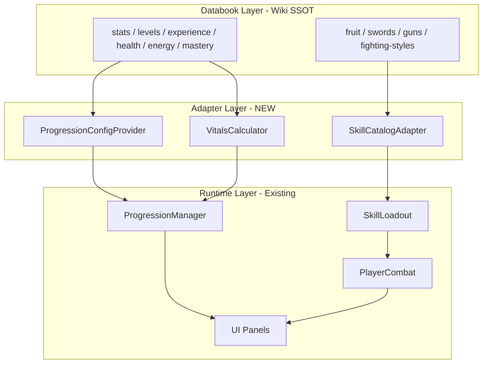

# ข้อเสนอการพัฒนาระบบ Blox Fruits ทั้งหมด

เอกสารนี้สรุป **สิ่งที่ทำแล้ว** (Databook อ้างอิง Wiki) และเสนอ **แผนเชื่อมเข้าเกมจริง** ให้ครบทุกระบบแบบ Blox Fruits

อ้างอิง: [Blox Fruits Wiki](https://blox-fruits.fandom.com/wiki/Blox_Fruits) · โค้ดเกม: `client/src/` · แผนเดิม: [ROADMAP.md](../ROADMAP.md)

---

## 1. สรุปภาพรวม

### สถานะปัจจุบัน

| ชั้น | สถานะ | รายละเอียด |
|------|--------|------------|
| **เกมเล่นได้ (Phase 1–6)** | ✅ ทำงานแล้ว | โลก, เรือ, มอนสเตอร์, Combat Framework, Progression prototype, Quest 3 รายการ |
| **Databook (Wiki Reference)** | ✅ เกือบครบ | อาวุธ/ผลไม้/สกิล + ระบบ Stats/Levels/Energy/Mastery |
| **เชื่อม Databook → Runtime** | ⬜ ยังไม่ทำ | เกมยังใช้ค่า prototype ไม่ใช่ค่า Wiki |

### หลักการที่เสนอ

1. **Databook = แหล่งความจริงเดียว (Single Source of Truth)** สำหรับตัวเลข/ไอเทม/สกิล
2. **Runtime = Adapter บางชั้น** ที่อ่านจาก Databook แล้วคำนวณค่าจริงในเกม
3. **ทำทีละชั้น** ไม่รื้อ Combat Framework — ต่อจาก `ProgressionManager`, `PlayerCombat`, `SkillLoadout` ที่มีอยู่
4. **Prototype → Wiki** ค่อย ๆ แทนที่ค่าใน `ProgressionData.ts` ด้วย `*Formulas.ts` จาก databook

---

## 2. สรุป Databook ที่สร้างแล้ว

### 2.1 อาวุธและสกิล (Combat Content)

| โมดูล | Path | จำนวน | สกิล | หมายเหตุ |
|--------|------|-------|------|----------|
| **ผลไม้** | `fruit/` | 41 ผล | 270 | Z/X/C/V/F, V1/V2/Awakened |
| **ดาบ** | `swords/` | 40 ดาบ | 88 | ส่วนใหญ่ Z/X |
| **ปืน** | `guns/` | 18 ปืน | 34 | Shotgun = admin-only |
| **ท่าต่อสู้** | `fighting-styles/` | 12 สไตล์ | 37 | Z/X/C/V บางสไตล์ |
| **รวมสกิล** | — | **111 ไอเทม** | **429 สกิล** | จาก Fandom Wiki |

**SkillLoadout** (`combat/SkillLoadout.ts`) — สร้างแล้วแต่ **ยังไม่ต่อเกม**:

- สลับชุด `weapon` / `fruit`
- อาวุธ: sword / gun / fighting-style (ทีละชนิด)
- ผลไม้: Z/X/C/V + logic awakening
- ปลดสกิลตาม Mastery จาก databook

### 2.2 ระบบตัวละคร (Mechanics Databook)

| ระบบ | Path | สูตร/ค่าสำคัญ | สถานะ PR |
|------|------|----------------|----------|
| **Stats** | `stats/` | 5 สเตตัส, 12 build presets, damage ~78.26× | ✅ merged |
| **Levels** | `levels/` | Max Lv 2800, EXP `floor(2×L^2.3+84)`, Sea gates 700/1500 | ✅ merged |
| **Experience** | `experience/` | แหล่ง EXP, 2x boost, multipliers, milestones | PR #6 |
| **Health** | `health/` | HP `5×(Defense+19)`, Aura −30%, max 14,095–20,733 | PR #7 |
| **Energy** | `energy/` | Energy `5×(Melee+19)`, Dash 30, max 18,180 | PR #8 |
| **Mastery** | `mastery/` | Max 600, EXP `⌈L^2.26+69⌉`, bonus stat, x2.70 mult | PR #8 |

### 2.3 สูตรหลักที่ต้องใช้ร่วมกัน

```
Player EXP/level  = floor(2 × level^2.3 + 84)
HP                = 5 × (Defense + 19)
Energy            = 5 × (Melee + 19)
Mastery EXP/lv    = ⌈masteryLvl^2.26 + 69⌉
Mastery bonus stat= (M/4) + PlayerLvl × (M/600) × 0.1
Damage mult       = 1 + statPts × (77.26 / 2800)   → ~78.26× ที่ max
```

---

## 3. สิ่งที่เกมรันอยู่จริง (Runtime Prototype)

### 3.1 ระบบที่เชื่อมแล้ว

```
main.ts
├── ProgressionManager     ← Level, Stats, Mastery, Save
├── PlayerCombat           ← M1 combo, Block, 3 สกิล hardcoded
├── Loadout (5 ช่อง)       ← basic-brawl + training-sword เท่านั้น
├── MonsterManager         ← EXP/Mastery/Coins จาก RewardSystem
├── QuestManager           ← 3 quests
└── UI                     ← HUD, StatsPanel, QuestTracker (MasteryPanel ยังไม่ mount)
```

### 3.2 ช่องว่าง Databook vs Runtime

| หัวข้อ | Wiki (Databook) | Runtime ปัจจุบัน (`ProgressionData.ts`) |
|--------|-----------------|----------------------------------------|
| Max Level | 2800 | **100** |
| Max Stat | 2800/stat | **100**/stat |
| Player EXP | `2×L^2.3+84` | `80+35L+4L²` |
| Max Mastery | 600 | **300** |
| Mastery EXP | `⌈L^2.26+69⌉` | `40+18L+1.6L²` |
| HP | +5/Defense | 100 + **8**/Vitality |
| Energy | +5/Melee | 100 + **4**/Combat |
| Dash cost | 30 (Rabbit 15) | **12** |
| ไอเทม | 111 ชนิด | **2** ชิ้น |
| สกิล | 429 สกิล | **3** สกิล |

---

## 4. สถาปัตยกรรมเป้าหมาย



### 4.1 โมดูลใหม่ที่แนะนำ

| โมดูล | หน้าที่ |
|--------|---------|
| `progression/WikiProgressionConfig.ts` | อ่าน `levels`, `stats`, `mastery`, `experience` databook แทน `PROGRESSION_CONFIG` |
| `progression/VitalsProvider.ts` | คำนวณ HP/Energy จาก `health` + `energy` + `stats` |
| `combat/SkillCatalog.ts` | แปลง databook skill → `SkillDefinition` สำหรับ `PlayerCombat` |
| `combat/SkillLoadoutBridge.ts` | เชื่อม `SkillLoadout` กับ `Loadout` + input Z/X/C/V |
| `ui/LoadoutPanel.ts` | UI 5 ช่อง + สลับ weapon/fruit set |
| `ui/DatabookPanel.ts` (optional) | หน้าอ่าน databook ในเกม (Codex) |

---

## 5. แผนดำเนินการ (Implementation Phases)

แผนนี้ **ต่อจาก ROADMAP Phase 7** โดยแบ่งเป็น 6 ขั้น แต่ละขั้นมี deliverable ชัดเจน

---

### Phase A — รวม Databook + ทำ Config Provider ⬜

**เป้าหมาย:** merge PR ที่ค้าง + มีจุดเดียวอ่านค่า Wiki

| งาน | รายละเอียด |
|-----|------------|
| A.1 | Merge PR #6–#8 (experience, health, energy, mastery) เข้า base |
| A.2 | สร้าง `progression/WikiProgressionConfig.ts` re-export ค่าจาก databook |
| A.3 | Feature flag `?wikiProgression=1` สลับ prototype ↔ wiki |
| A.4 | Unit tests เปรียบเทียบค่า prototype vs wiki |

**ผลลัพธ์:** เปิด flag แล้วเลเวล/EXP/HP/Energy ใช้สูตร Wiki ได้

---

### Phase B — ระบบตัวละครครบ (Stats · Levels · HP · Energy · Mastery) ⬜

**เป้าหมาย:** ตัวเลขผู้เล่นตรง Blox Fruits

| งาน | ใช้ Databook | แก้ Runtime |
|-----|-------------|-------------|
| B.1 Player Level/EXP | `levels/`, `experience/` | `LevelSystem.ts`, `ProgressionManager` |
| B.2 Stat Points | `stats/` | `StatSystem.ts`, `StatsPanel` |
| B.3 HP | `health/`, `stats/` | `getMaxHp()`, `CharacterController` |
| B.4 Energy | `energy/`, `stats/` | dash cost, regen, `getMaxEnergy()` |
| B.5 Mastery | `mastery/`, `stats/` | `MasterySystem.ts`, mount `MasteryPanel` |
| B.6 Sea Gates | `levels/databook/seaGates.ts` | ล็อกเกาะ/ทะเลที่ 2–3 (Phase 9) |

**กฎสำคัญที่ต้อง implement:**

- 3 stat points/level, max 3 stats ที่ 2800
- Level up / quest complete ฟื้น HP+Energy (ยกเว้นต่อสู้)
- Aura ลดดาเมจ 30% (เมื่อมีระบบ Aura)
- Mastery bonus stat ใช้กับดาเมจทุกประเภท

---

### Phase C — SkillLoadout + อาวุธ/สไตล์ (ROADMAP Phase 7) ⬜

**เป้าหมาย:** เล่นสกิลจาก databook ได้จริง ไม่ใช่ 3 สกิล hardcoded

| งาน | รายละเอียด |
|-----|------------|
| C.1 | เชื่อม `SkillLoadout` เข้า `main.ts` + save state |
| C.2 | ปุ่มสลับ `weapon` ↔ `fruit` (แทน/คู่กับ Loadout 5 ช่อง) |
| C.3 | `SkillCatalog`: map `FRUIT_SKILLS` / `SWORD_SKILLS` → `SkillDefinition` |
| C.4 | Input Z/X/C/V แทน 1/2/3 บน PC + mobile |
| C.5 | ตรวจ mastery + energy cost ก่อน cast |
| C.6 | Fighting Style 12 สไตล์ + NPC ครู (ซื้อ/เปลี่ยน) |
| C.7 | Sword 40 เล่ม — ดรอป/ร้าน (เริ่มจาก 3–5 เล่ม) |
| C.8 | Gun 17 เล่ม — เริ่มจาก 2–3 เล่ม |

**ลำดับความสำคัญเนื้อหา:**

1. Combat (fighting-style พื้นฐาน) — มีอยู่แล้วใน databook
2. Godhuman / Superhuman — สไตล์ยอดนิยม
3. ดาบระดับกลาง (Bisento, Saber, etc.)
4. ปืน (Flintlock, Rifle)

---

### Phase D — ผลไม้ปีศาจ (ROADMAP Phase 8) ⬜

**เป้าหมาย:** ระบบ Fruit ครบวงจร

| งาน | รายละเอียด |
|-----|------------|
| D.1 | Fruit Dealer + Gacha (Common → Mythical) |
| D.2 | กินผล → เปลี่ยน `equippedFruitId` + passive |
| D.3 | Moveset V1/V2/Transformed ตาม `fruitAwakened` |
| D.4 | Mastery ต่อผล + ปลดสกิลตาม databook |
| D.5 | Fruit spawn จุดบนเกาะ |
| D.6 | สกิลพิเศษ: Bomb (แลก HP), mobility ตาม HP |

**เริ่มจากผลง่าย:** Rocket, Spin, Chop → ขยายเป็น Buddha, Dough, Leopard

---

### Phase E — โลกและ Progression ขั้นสูง (ROADMAP Phase 9–11) ⬜

| งาน | Databook ที่ใช้ |
|-----|----------------|
| เกาะที่ 2–3 + Sea gates | `levels/seaGates` |
| Boss level rewards ตรง | `levels/bossLevelRewards` |
| Bounty / PvP rules | `levels/bountyRules` |
| EXP sources (fishing, gravestone) | `experience/sources` |
| Raid / Awakening / Sea Events | สร้าง databook เพิ่มเมื่อถึง Phase |

---

### Phase F — Multiplayer & Live Service (ROADMAP Phase 10–12) ⬜

- Server authoritative progression
- Sync loadout / mastery / inventory
- Trading, Crew, PvP, Events

---

## 6. แผนเชื่อมทีละไฟล์ (Technical Checklist)

### 6.1 Progression

```
ProgressionData.ts          → อ่านจาก WikiProgressionConfig (feature flag)
LevelSystem.ts              → ใช้ levels/LevelFormulas.ts
StatSystem.ts               → ใช้ stats/StatFormulas.ts + health/energy
MasterySystem.ts            → ใช้ mastery/MasteryFormulas.ts
ProgressionManager.ts       → inject VitalsProvider
ProgressionSave.ts          → migrate save v2 (wiki stats)
```

### 6.2 Combat

```
CombatData.ts               → เหลือเฉพาะ constants (guard, regen) — ย้าย skills ออก
SkillCatalog.ts             → NEW: databook → SkillDefinition[]
SkillLoadoutBridge.ts       → NEW: resolveSlots() → active skills
PlayerCombat.ts             → รับ skills จาก bridge ไม่ hardcode
Loadout.ts                  → sync กับ SkillLoadout state
TouchControls.ts            → Z/X/C/V + toggle fruit/weapon
```

### 6.3 UI

```
StatsPanel.ts               → แสดง Blox stat names (Melee/Defense/...)
MasteryPanel.ts             → mount ใน main.ts
LoadoutPanel.ts             → NEW: 5 ช่อง + equip จาก databook
ProgressionHUD.ts           → แสดง EXP bar ตาม wiki formula
```

---

## 7. โครงสร้างโฟลเดอร์เป้าหมาย

```
client/src/
├── fruit/ swords/ guns/ fighting-styles/   ✅ databook + skills
├── stats/ levels/ experience/              ✅ mechanics databook
├── health/ energy/ mastery/                ✅ mechanics databook (merge PR)
├── progression/
│   ├── WikiProgressionConfig.ts           ⬜ NEW
│   ├── VitalsProvider.ts                  ⬜ NEW
│   └── ... (existing, refactor)
├── combat/
│   ├── SkillLoadout.ts                    ✅ exists
│   ├── SkillCatalog.ts                    ⬜ NEW
│   ├── SkillLoadoutBridge.ts              ⬜ NEW
│   └── ...
└── ui/
    ├── LoadoutPanel.ts                    ⬜ NEW
    └── MasteryPanel.ts                    ✅ exists, not mounted
```

---

## 8. ความเสี่ยงและข้อจำกัด

| ความเสี่ยง | แนวทาง |
|-----------|--------|
| 429 สกิล — ใหญ่เกิน implement ทีเดียว | ทำ **Skill Runtime Template** 5–10 แพทเทิร์น (projectile, AOE, dash, buff) แล้ว map databook |
| สกิล wiki มีรายละเอียดซับซ้อน | Phase 1 ใช้ damage/range/cooldown/energy จาก databook; VFX/behavior ทำทีหลัง |
| Save migration | เวอร์ชัน save v2 + fallback ค่าเดิม |
| Performance มือถือ | โหลด skill เฉพาะที่ equip; ไม่โหลด 429 สกิลพร้อมกัน |
| ค่า prototype กับ wiki ต่างมาก | Feature flag ให้ทดสอบ wiki แยกจาก demo เดิม |

---

## 9. ลำดับความสำคัญที่แนะนำ

```
1. Merge databook PR ทั้งหมด                    [1–2 วัน dev]
2. Phase A: WikiProgressionConfig + feature flag [2–3 วัน]
3. Phase B: HP/Energy/Level/Mastery ตรง wiki   [1 สัปดาห์]
4. Phase C: SkillLoadout + 1 fighting style     [1–2 สัปดาห์]
5. Phase C: + 3 swords, 2 guns                  [1 สัปดาห์]
6. Phase D: Fruit framework + 3 ผลง่าย          [2 สัปดาห์]
7. Phase E+: เกาะ, boss, raid                   [ต่อ ROADMAP]
```

---

## 10. เกณฑ์สำเร็จ (Definition of Done)

### ขั้นต่ำ (MVP Blox-like)

- [ ] เลเวล 1–100+ ใช้สูตร EXP wiki
- [ ] HP/Energy คำนวณจาก Defense/Melee ตรง wiki
- [ ] สลับ weapon/fruit set ได้
- [ ] สกิล Z/X จาก databook อย่างน้อย 1 สไตล์ + 1 ดาบ + 1 ผล
- [ ] Mastery ปลดสกิลตาม databook
- [ ] Save/โหลด loadout + progression ได้

### ครบตาม Databook

- [ ] ระบบ Stats/Levels/EXP/Health/Energy/Mastery ตรง wiki ทุกสูตร
- [ ] เนื้อหา 111 ไอเทมพร้อมในเกม (อย่างน้อย obtainable)
- [ ] 429 สกิลมี runtime (แม้ behavior จะย่อ)
- [ ] Sea gates, boss rewards, bounty rules ทำงาน
- [ ] Codex UI อ่าน databook ในเกมได้

---

## 11. PR / Branch ที่เกี่ยวข้อง

| PR | Branch | เนื้อหา |
|----|--------|---------|
| #4 | `cursor/fruit-skill-databook-c052` | Fruit + Swords + Guns + Fighting Styles (merged) |
| #6 | `cursor/experience-databook-c052` | Experience databook |
| #7 | `cursor/health-databook-c052` | Health databook |
| #8 | `cursor/energy-mastery-databook-c052` | Energy + Mastery databook |

**ขั้นแรกที่ควรทำ:** merge #6, #7, #8 → เริ่ม Phase A

---

## 12. สรุปท้าย

| สิ่งที่มี | สิ่งที่ต้องทำ |
|----------|--------------|
| เกม vertical slice เล่นได้ Phase 1–6 | เปลี่ยนตัวเลข prototype → wiki |
| Databook 111 ไอเทม + 429 สกิล | เชื่อม `SkillLoadout` + `SkillCatalog` |
| สูตรครบ 6 ระบบหลัก | `WikiProgressionConfig` + `VitalsProvider` |
| Combat Framework พร้อม | ขยายสกิลจาก 3 → databook-driven |
| ROADMAP 12 Phase | ใช้เอกสารนี้เป็น **แผนเชื่อม Databook** ระหว่าง Phase 6→7→8 |

**แนวทางหลัก:** ไม่สร้างระบบใหม่ซ้ำ — **เชื่อม Databook ที่มีเข้ากับ Runtime ที่มี** ผ่าน Adapter ชั้นบาง ๆ แล้วค่อย ๆ เปิดเนื้อหา (ไอเทม/สกิล) ทีละกลุ่ม

---

*อัปเดต: กรกฎาคม 2026 · สร้างจากสถานะ repo `claude/blox-fruits-three-js-roadmap-1f2f5u` + feature branches*
