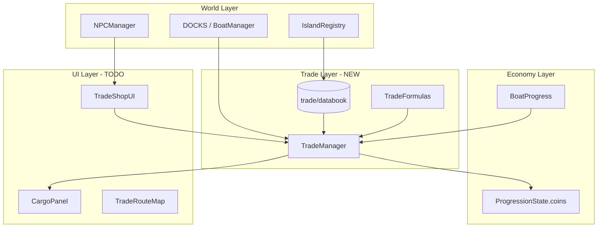

# ข้อเสนอระบบเทรดระหว่างเกาะ (Inter-Island Trading)

เอกสารวางแผนระบบการค้าขายข้ามเกาะ ออกแบบให้ทำงานร่วมกับ **ระบบเรือ**, **IslandRegistry** และ **เศรษฐกิจ Beli** ที่มีอยู่

---

## 1. เป้าหมาย

| เป้าหมาย | รายละเอียด |
|----------|------------|
| **Gameplay loop** | ซื้อถูกเกาะ A → ขับเรือ → ขายแพงเกาะ B → กำไร Beli |
| **ผูกกับเรือ** | สินค้าเก็บใน **cargo บนเรือ** ความจุตามประเภทเรือ |
| **ขยายเกาะได้** | เพิ่มเกาะใหม่ = เพิ่ม market + routes + vendors ใน databook |
| **Single-player ก่อน** | NPC vendor + arbitrage; P2P trade ทำทีหลัง (Multiplayer) |
| **แยกจาก Equipment** | สินค้าเทรด (ปลา, เครื่องเทศ) ≠ ดาบ/ผลไม้ (gacha/inventory) |

---

## 2. สิ่งที่มีอยู่แล้ว (Foundation)

### 2.1 เกาะ (3 เกาะ)

| IslandId | ชื่อ | ท่าเรือ | เลเวลแนะนำ |
|----------|------|---------|------------|
| `starter-island` | เกาะเริ่มต้น | `starter-harbor` | 1–14 |
| `mist-jungle` | พงไพรหมอก | `mist-jungle-harbor` | 15–30 |
| `sunscar-desert` | ทะเลทรายสุริยะ | `sunscar-desert-harbor` | 31–50 |

- `client/src/island/IslandRegistry.ts` — นิยามเกาะ, dock, heightAt
- `client/src/world/WorldPOI.ts` — POI ต่อเกาะ

### 2.2 ระบบเรือ

- `BoatData.ts` — เรือพายฝึกหัด, เรือใบวายุ
- `BoatManager.ts` — ขับ, จอดท่า, ขึ้น/ลงเรือ
- `BoatProgress.ts` — ซื้อ/เลือกเรือ, ใช้ `EconomyWallet`

### 2.3 เศรษฐกิจ

- `ProgressionState.coins` — Beli หลัก
- `ItemInventory` + `GachaData` — สุ่มอาวุธ/ผลไม้ (แยกจากเทรดสินค้า)
- ราคาอาวุธใน databook (`price` field) — อ้างอิง wiki ยังไม่ผูก vendor

### 2.4 ช่องว่าง

- ไม่มีสินค้าเทรดแบบ stack ได้
- ไม่มี cargo บนเรือ
- ไม่มีร้านค้าซื้อ/ขายตามเกาะ
- NPC `shopkeeper-pao` ยังเป็น dialogue เท่านั้น

---

## 3. ระบบเทรดที่เตรียมไว้

### 3.1 โมดูล `client/src/trade/`

```
trade/
├── types.ts                 # Commodity, Market, Route, Vendor, Cargo
├── TradeFormulas.ts         # buyPrice, sellPrice, arbitrage
├── TradeRegistry.ts         # lookup helpers
├── TradeManager.ts          # runtime scaffold (buy/sell/cargo)
├── databook/
│   ├── config.ts            # ค่าธรรมเนียม, cargo default
│   ├── commodities.ts       # สินค้า 10 ชนิด
│   ├── islandMarkets.ts     # ตลาด 3 เกาะ
│   ├── tradeRoutes.ts       # เส้นทาง 6 เส้น
│   ├── vendors.ts           # NPC 6 คน
│   └── rules.ts             # กฎการเทรด
└── __tests__/tradeDatabook.test.ts
```

### 3.2 สินค้าเทรด (Commodities)

| สินค้า | เกาะส่งออก | เกาะต้องการนำเข้า |
|--------|------------|-------------------|
| ปลาสด, ไม้ | Starter | Mist, Sunscar |
| สมุนไพร, เครื่องเทศ, ซากโบราณ | Mist Jungle | Starter, Sunscar |
| เกลือ, ผ้าไหม, อัญมณี, น้ำกระบอง | Sunscar Desert | Starter, Mist |

### 3.3 กลไกราคา

```
ราคาซื้อ  = basePrice × buyMultiplier   (export เกาะต้นทาง ≈ 0.65–0.8)
ราคาขาย   = basePrice × sellMultiplier × (1 - fee 5%)
กำไร      = ราคาขายปลายทาง - ราคาซื้อต้นทาง
```

**ตัวอย่าง:** ซื้อปลาสดที่เกาะเริ่มต้น → ขายที่ทะเลทราย → กำไรต่อหน่วย (ทดสอบใน unit test)

### 3.4 Cargo บนเรือ

| เรือ | ช่อง | น้ำหนักสูงสุด |
|------|------|--------------|
| เรือพายฝึกหัด | 8 | 120 |
| เรือใบวายุ | 12 | 180 |

- เก็บใน `localStorage` key `pirate-fruit:cargo-v1`
- `TradeManager` จัดการ buy → เพิ่ม cargo, sell → หัก cargo

---

## 4. สถาปัตยกรรม



### 4.1 Integration Points

| จุดเชื่อม | งาน |
|-----------|-----|
| `NPCDefinition` | เพิ่ม `kind: 'trade-vendor'` + `vendorId` |
| `BoatManager` | เรียก `TradeManager.setBoat()` เมื่อเปลี่ยนเรือ |
| `ProgressionManager` | implement `TradeWallet` จาก coins |
| `main.ts` | สร้าง `TradeManager`, เปิด UI เมื่อคุย vendor |
| `IslandRegistry` | เกาะใหม่ → เพิ่ม market + routes อัตโนมัติจาก databook |
| `SaveSystem` | รวม cargo เข้า progression save (migration) |

---

## 5. แผนพัฒนา (Phases)

### Phase T1 — Databook + Tests ✅ (เตรียมแล้ว)

- [x] `trade/` module + commodities + markets + routes + vendors
- [x] `TradeFormulas` + `TradeManager` scaffold
- [x] Unit tests

### Phase T2 — UI ร้านค้า ✅

- [x] `TradeShopUI.ts` — แสดงสินค้า, ราคาซื้อ/ขาย, ปุ่ม +/- quantity
- [x] `TradeRouteHint` — แสดงเส้นทางกำไรจากเกาะปัจจุบัน
- [x] ผูก NPC vendor (เถ้าแก่เปา, แพทย์สาย, ซาฮีร์)
- [x] wire `TradeManager` + `main.ts` + boat cargo sync

### Phase T3 — Gameplay Loop ✅ (บางส่วน)

- [x] Quest เทรด 3 รายการ (deliver objective)
- [x] `QuestManager` รับ `trade:completed` event
- [ ] รีเฟรชสต็อกร้าน (optional)
- [ ] เสียง/เอฟเฟกต์เมื่อทำกำไร

### Phase T4 — ขยายเกาะ ⬜

เมื่อเพิ่มเกาะใหม่ ทำ checklist:

1. เพิ่ม `IslandId` ใน `IslandTypes.ts`
2. เพิ่ม `IslandDefinition` + `Dock` ใน `IslandRegistry`
3. เพิ่ม `ISLAND_MARKETS` entry (export/import roles)
4. เพิ่ม `TRADE_ROUTES` จาก/ไปเกาะเดิม
5. เพิ่ม `TRADE_VENDORS` + NPC บนเกาะ
6. (Optional) สินค้าใหม่ใน `TRADE_COMMODITIES`

### Phase T5 — ขั้นสูง ⬜

- [ ] ราคา dynamic ตาม supply/demand server-side
- [ ] Black market vendor (ราคาดีกว่าแต่มีความเสี่ยง)
- [ ] สัญญาเทรดรายสัปดาห์ (bonus Beli)
- [ ] Fragments / Valor เป็นสกุลเงินเทรดพิเศษ

### Phase T6 — Multiplayer Trading ⬜ (ROADMAP Phase 10)

- [ ] Player-to-player trade window
- [ ] Server validation ป้องกัน duping
- [ ] Trade log + escrow

---

## 6. ความสัมพันธ์กับระบบอื่น

| ระบบ | ความสัมพันธ์ |
|------|-------------|
| **เรือ** | Cargo บนเรือ, ต้องจอดท่าเพื่อซื้อ/ขาย |
| **เกาะ** | แต่ละเกาะมีตลาดเฉพาะ export/import |
| **Quest** | เควสส่งของข้ามเกาะ → Beli + EXP |
| **Gacha Shop** | แยกชัด — gacha = equipment, trade = commodities |
| **Boat Shop** | เรือใหญ่ขึ้น = cargo มากขึ้น = กำไรต่อเที่ยวสูงขึ้น |
| **Progression** | Beli จากเทรด + มอนสเตอร์ + quest ใช้กระเป๋าเดียวกัน |

---

## 7. UI ที่แนะนำ

### หน้าร้านค้า (Trade Shop)

```
┌─────────────────────────────────────┐
│  🏪 ตลาดหมู่บ้านโจรสลัด              │
│  Beli: 1,250                         │
├──────────┬────────┬────────┬────────┤
│ สินค้า    │ ซื้อ   │ ขาย    │ ในเรือ │
├──────────┼────────┼────────┼────────┤
│ 🐟 ปลาสด  │   31   │   21   │   12   │
│ 🪵 ไม้    │   45   │   33   │    0   │
│ ...      │        │        │        │
├──────────┴────────┴────────┴────────┤
│ Cargo: 5/8 ช่อง · น้ำหนัก 42/120    │
│ [ซื้อ] [ขายทั้งหมด] [ปิด]           │
└─────────────────────────────────────┘
```

### แผนที่เส้นทาง (Minimap overlay)

- ลูกศรเส้นทางกำไรสูงจากเกาะปัจจุบัน
- แสดงระยะทางโดยประมาณ

---

## 8. Checklist เมื่อเพิ่มเกาะใหม่

```markdown
- [ ] IslandTypes.ts — IslandId
- [ ] IslandRegistry.ts — ISLANDS + DOCKS
- [ ] *Island.ts — สร้างฉาก
- [ ] WorldPOI.ts — POI ใหม่
- [ ] trade/databook/islandMarkets.ts — ตลาด
- [ ] trade/databook/tradeRoutes.ts — เส้นทางไป/กลับ
- [ ] trade/databook/vendors.ts — NPC ผู้ค้า
- [ ] trade/databook/commodities.ts — (ถ้ามีสินค้าเฉพาะ)
- [ ] npc/NPCData.ts — วาง NPC
- [ ] quest/ — เควสเทรด (optional)
```

---

## 9. API สำคัญ (TradeManager)

```typescript
// ซื้อสินค้า — หัก Beli, เพิ่ม cargo
tradeManager.buy('starter-island', 'fresh-fish', 10);

// ขายสินค้า — เพิ่ม Beli, หัก cargo
tradeManager.sell('sunscar-desert', 'fresh-fish', 10);

// เปลี่ยนเรือ — ปรับ cargo capacity
tradeManager.setBoat('swift-sloop');

// อ่าน cargo
tradeManager.hold; // { slots, maxSlots, maxWeight }
```

---

## 10. สรุป

| สถานะ | รายการ |
|-------|--------|
| ✅ เตรียมแล้ว | Databook สินค้า 10 ชนิด, ตลาด 3 เกาะ, เส้นทาง 6 เส้น, vendor 6 คน |
| ✅ เตรียมแล้ว | สูตรราคา, arbitrage, cargo capacity ต่อเรือ |
| ✅ เตรียมแล้ว | `TradeManager` scaffold + unit tests |
| ⬜ ถัดไป | UI ร้านค้า + ผูก NPC + wire เข้า main.ts |
| ⬜ อนาคต | Quest เทรด, เกาะใหม่, P2P multiplayer |

**หลักการ:** ซื้อถูกที่เกาะผลิต → ขับเรือ → ขายแพงที่เกาะต้องการ — สร้าง loop การค้าที่ผูกกับการขยายเกาะและอัปเกรดเรือ

---

*อัปเดต: กรกฎาคม 2026 · ออกแบบสำหรับ starter / mist-jungle / sunscar-desert*
